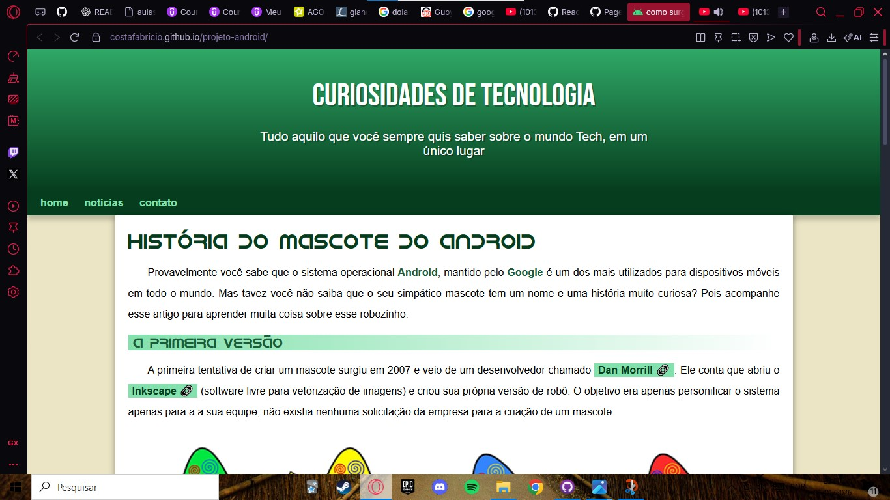
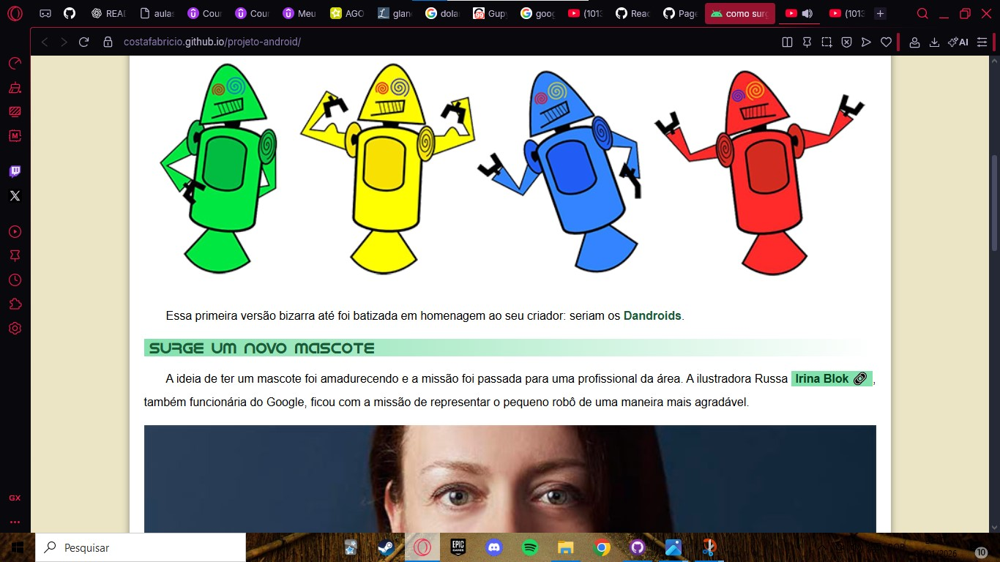
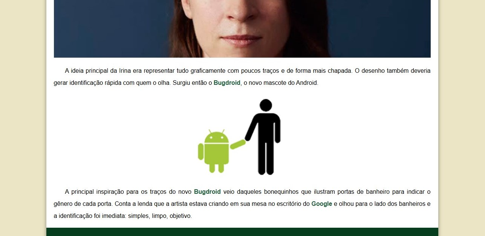
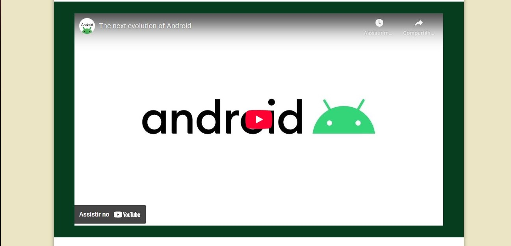
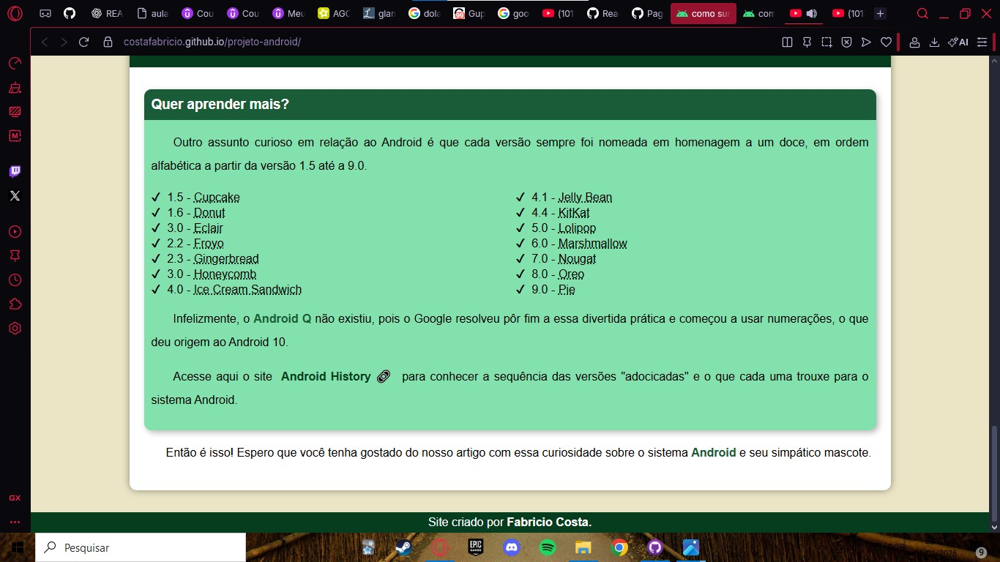

<h1 align="center" style="font-weight: bold;">Projeto Android💻</h1>

 <a href="#tech">Technologies</a>

    <b>Projeto Android</b>

     <a href="https://costafabricio.github.io/projeto-android/">📱 Visit this Project</a>

<h2 id="layout">🎨 Layout</h2>

    
  
  
  
  

<h2 id="technologies">💻 Technologies</h2>

- list of all technologies you used
- HTML
- CSS
